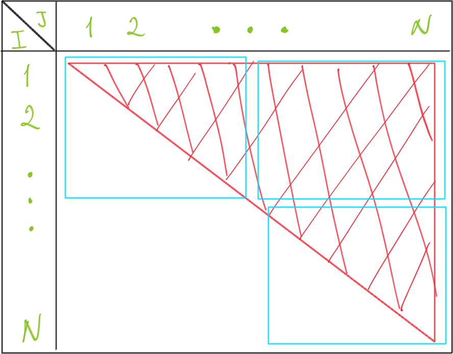

[//]: # (To preview markdown file in Emacs type C-c C-c p)

# [Assignment 3: OpenMP](https://www.raum-brothers.eu/martin/Chalmers_TMA881_1920/assignments.html#openmp)
> In this assignment, we count distances between points in 3-dimensional space. One possibility to think of this is as cells, whose coordinates were obtained by diagnostics and which require further processing.

> Distances are symmetric, i.e. distance between two cells c\_1 and c\_2 and the distance in reverse direction c\_2 to c\_1 should be counted once.

## Relevant concepts
* **Elementary functions.** Complicated mathematical operations should be avoided when possible. In this assignment, it is better to multiply the coordinate differences by itself rather than square them when computing the cell distance. 
* **Use of intrinsics.** In order to speed up the computation, we can make use of intrinsics for computing the distances between the coordinates. To this end, SSE functions like `__m128 _mm_sqrt_ps`or `__m128 _mm_sqrt_ps` can be employed. This will be considered for implementation if the program has difficulties passing the performance tests.
* **Inlining.** We've learned that providing additional information to the compiler about external functions can be advantageous, especially if function is called multiple times during runtime. 
* **Synchronization of parallel computations.** Since distances do not need to be stored, it is only necessary to increment the corresponding entries in the frequency array. To this end, when computing the distances between cells in different blocks, a suitable sum `reduction` may be used.
* **Efficient reading and parsing of the input file.** Since the format of the coordinates in the input file is fixed, we can optimise the reading process. To this end, we implemented a custom character to short conversion instead of using the standard library function `strtol`. This improved the performance significantly.  Because of the external limitation of the program not using more than 1GiBi of memory, we need special treatments for large input files. For details, see the section **Reading coordinates from a file**.
* **Efficient computation of the distances.** Due to accuracy tolerance it is possible to streamline the computation of the distances. Because of the design decision to store the coordinates as integers, it is rather cheap to compute individual coordinate differences and square them. The `sqrtf` function is called only once, and the result is then rounded and cast into a short. In order to round the answer, we decided not to use the standard `round` function, as it proved costly. Instead, we round the distance manually. 
* **Efficient use of memory and cache.** Everything we've learned about memory and locality applies in this assignment as well. Ideally we would like to perform as many operations with data loaded from memory as possible to avoid reloading it. For example, the coordinates of a specific cell are likely to be contained within a cache line, making computation of the coordinate differences efficient. 

## Intended program layout

Following the structure of the task, the program is split into the following tasks:

1. Reading coordinates from a text file.
1. Computing distances between the cells and counting frequencies.
1. Printing to standard output (screen).


### Reading coordinates from a file

Knowing that the format for the triplet of coordinates **X, Y, Z** is fixed to 5 significant digits for each coordinate (e.g. `+01.330 -09.035 +03.489`), it was decided to read the numbers as **shorts** (i.e. as `+1330 -9035 +3489`). Since the coordinates are between `-10` and `10`, it is possible to store them as signed shorts between `-10000` and `10000`. However, a restriction was imposed by the task on the amount of memory that the program could use. That is why, in order to handle files that would require more than 1 GiB of memory if read at once, a partial reading procedure was adopted. In the extreme, for 2^32 cells the file takes about 100 GB of disk space. We would need 48GB of memory if the coordinates are stored as integers or 24 GB of memory when we store them as shorts. Either way, it is not possible to handle such large input at once. The strategy here can be to decide (based e.g. on the size of the input file) to split the reading into blocks that will fit into the memory. After computing the distances between the cells contained within the currently loaded block, we keep it in memory and sequentially look up the cells from previous block(s) in order to compute the distance between them and the cells within current block. We repeat this until all the distances between cells from the previous block(s) and the current block are computed. After that we load the next block. For details, see the section **Memory management**
### Memory management
The program cannot access more than 1 GiBi of memory; in other words, a maximum of `max_load_lines = 178956970` cells can be loaded at once if the *short* data type is used. In the case of the input file containing more cells than this limit, we need to load the file sequentially. To guarantee there will be no segmentation fault, we choose to load a maximum of `max_load_lines = 170000000` cells, and keep `75 MB` memory free.

-  **Determination of total cells in the file.** Using `fseek(FILE,0L,SEEK_END)` and `res = ftell(FILE)`, the the total size of the file can be determined. Since each cell has the size of `24` bytes, we can compute the total cell number in the input file as `total_lines  = res / 24`.
-  **Number of blocks the file is split into.** Since we know that there is `total_lines` cells in the file, we can compute the number of blocks the file can be split into. The operation `total_lines % max_load_lines` can tell whether the last block contains  fewer cells less than `max_load_lines`. If it is the case, the number of blocks is computed as `total_lines / max_load_lines + 1`. Otherwise, the number of blocks number is `total_lines / max_load_lines`.
- **Number of cells stored in each block.** As mentioned before, if `total_lines % max_load_lines = 0`, it means every block can store `max_load_lines` cells. If  `total_lines % max_load_lines = n`, then the last block will store only `n` cells. Note that `n < max_load_lines`.

When the program starts, it loads the first block of cells. It can contain either `max_load_lines` or `n` cells, and the program computes the distances between the cells in that block. After that, the program will try to load the next block. If there are no more blocks, the program will free the memory and finish. If there are more blocks, the program will free the memory and load the next block, subsequently computing the distances between the cells within this block. Now, the program will not free the memory of this block of cells. Rather, it will look up the cells in the previous block(s), load those cells sequentially, and compute the distances between the loaded cells and the cells within the current block. 

For example, if cells `6` to `10` are loaded in the current block, the program will look up cells in the previous block that containng cells `1` to `5`. First, the program picks cell `1` and computes the distances between it and cells `6` to `10`. After that, it picks up cell `2` and computes the distances between it and cells `6` to `10`. The program repeats this procedure for all cells in the previous block(s). After that, it finishes and frees the memory.

### Computing distances and counts

The task asked to compute distances and counts with the precision of 2 decimals and lets us assume that the cells are bound to reside on the interval `[-10; 10]`. This means that the largest distance between the cells is **20 * &radic;3 ~= 34.64**, and that there are `3465` possible distances to be counted.

The distances were computed simply as

**distance = &radic; &Delta;X^2 + &Delta;Y^2 + &Delta;Z^2**

Next, the corresponding indices in the frequency array were obtained from

**index = (short) (distance/10 + 0.5)**

Note that division by `10` is performed to retain only 4 significant digits (present in number `3465`) and `0.5` was added to round up to the nearest integer instead of the largest integer not larger than `distance`. Then, the counter of the corresponding element in the array of counts was incremented:

**++counting[ index ]**


#### Parallelisation

Looping over cells was performed in parallel by means of the `parallel for` pragma presented in the lecture. Parallelization was performed on the outer loop in light of the memory access patterns discussed during the lectures. Since distances are symmetric, the computations involved the triangular part of the matrix illustrated below.



Here, indices `I` and `J` denote cells (up to `N` cells) between which the distance is computed. Therefore, the matrix traversal is performed by means of two nested loops:
```
#pragma omp parallel for ...
for ( I = 0; I < N; ++I ){
    for ( J = 0; J < N; ++J ){
        // compute distance.
        // compute index.
        // increment count: ++counting[ index ]
    }
}
```
The **private** variables are `I, J`, `distance` and `index`. The **shared** variables are the number of points `N` and the array of counts `counting`, to which the reduction is done via `+:counting[:3465]`.

Lastly, no sorting is necessary for printing, as the elements of `counting` already represent distances in ascending order.
